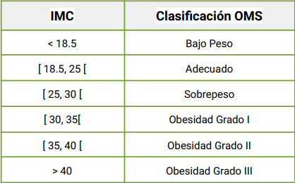

## Ejercios Evaluados - Sentencias condicionales e iterativas (I)

### [IMC](https://github.com/Cy5k0/Ejercicios_Evaluados_Python/blob/main/02/imc.py)

El Índice de masa corporal, es una medida que asocia el peso de una persona con su talla (su altura). Este valor es utilizado normalmente como un indicador nutricional y constituye un índice fácil y sencillo de calcular para determinar el estado de obesidad y sobrepeso de una persona. El IMC se calcula de la siguiente manera:

IMC = peso / altura²

Para ello, la Organización Mundial de la Salud (OMS) ha determinado una clasificación así para distintos rangos de valores:

Se usan 2 funciones, una principal ***calculadora_imc*** y otra que es usada para llamarla para la verificación de las variables que sean tipo float ***verificador_float***

##### Variables: 

- peso_input: variable tipo float, usada para colocar valor verificado dentro de variable peso.
- peso: variable tipo float, que corresponde al peso del individuo en [Kg].
- altura_input: variable tipo float, usada para colocar el valro verificado dentro de la variable altura.
- altura: variable tipo float, que corresponde a la altura del individuo en  [Cm].
- IMC: variable tipo float que corresponde a la variable del Indice de Masa Corporal la cual es la resultante de la ecuación realizada.
- repetir: variable tipo string usada para repetir o dar fin al programa

##### Prerequisitos

* Sistema Operativos: Windows 10, 11, Linux, iOS.
* Python 3.12

##### Ejecución

###### Windows
`python imc.py`

###### Linux y iOS
`python3 imc.py`

#### Autor
[Francisco Colomer B](https://github.com/Cy5k0)

-----------------------------------------------

### [Cachipun](https://github.com/Cy5k0/Ejercicios_Evaluados_Python/blob/main/02/cachipun.py
)

El *Cachipún*, conocido también como *piedra, papel o tijera*, o en paises anglos *rock, paper, scissor* o "stone, paper, scissor*, es un juego de manos en el que existen tres elementos: la piedra que vence a la tijera rompiéndola, la tijera que vence al papel cortándoloy el papel que vence a la piedra envolviéndola, dando lugar a un círculo o ciclo cerrado. Se utiliza con mucha frecuencia para decidir quién de dos personas hará algo, tal y como se hace a veces usando una moneda, o para dirimir algún asunto.
Para poner en práctica lo que hemos aprendido a lo largo de la unidad, se implementará un programa en Python que permite jugar al cachipún en contra del computador.

El programa solicita especificar que idioma escoger entre español *(ES)* e inglés *(EN)* validando el correcto ingreso de la respuesta. Posterior pide al usuario escoger una mano (piedra, papel o tijera), donde finalmente pregunta si desea jugar de nuevo, finalmente entrega un puntaje sobre la cantidad de veces que se haya repetido el juego.

##### Libreria usada
- random : con el fin de poder seleccionar de forma aleatoria la mano del CPU

##### Variables: 

- score: variable global tipo int, variable que almacena el puntaje del jugador.
- cpu_score: variable global tipo int, variable que almacena el puntaje del CPU
- idioma: variable tipo fstring, que almacena la selección de idioma por parte del usuario.
- mano: variable tipo string, que corresponde la seleccion del jugador *(piedra, papel o tijera)*.
- mano_cpu: variable tipo string, que corresponde la seleccion del CPU *(piedra, papel o tijera)*.
- repetir: variable tipo string usada para repetir o dar fin al programa

##### Lista
- opciones_cpu: lista que contiene los string de *PIEDRA, PAPEL, TIJERA* para el idioma español, en inglés contiene *STONE, PAPER, SCISSOR*

##### Prerequisitos

* Sistema Operativos: Windows 10, 11, Linux, iOS.
* Python 3.12

##### Ejecución

###### Windows
`python cachipun.py`

###### Linux y iOS
`python3 cachipun.py`

#### Autor
[Francisco Colomer B](https://github.com/Cy5k0)